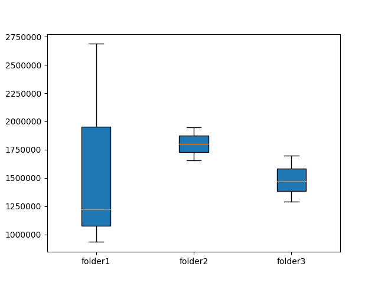

 [[](https://badge.fury.io/py/demort)  [](https://github.com/Grelot/demort/blob/master/LICENSE)


# DEMORT
DEmultiplexing MOnitoring Report Tool. DEMORT evaluates demultiplexing fastq files by computing various metrics.

`demort` evaluates demultiplexed fastq files by computing various metrics.
`demort` is a python3 program.

# INSTALLATION

First, install dependencies, then you can perform a basic installation or PyPI installation.

## Dependencies

You need to install [python 3.7](https://www.python.org/download/releases/3.0/) and depencies. Check version by typing on:
```
python3 --version
```
**python3 depencies :**
* argparse
* os
* gzip
* csv
* multiprocessing
* [joblib](https://joblib.readthedocs.io/en/latest/installing.html)
* [biopython](https://github.com/biopython/biopython)
* [matplotlib](https://matplotlib.org/3.1.1/faq/installing_faq.html)

see [INSTALL.sh](INSTALL.sh) for details about installation of python3 dependencies

## Basic installation

Simply download the [python script](src/demort.py)
```
wget https://raw.githubusercontent.com/Grelot/demort/master/src/demort.py
```
then execute it
```
python3 demort.py -h
```

## PyPI installation

Install `demort` on your system using :

```
pip3 install demort
```
check installation :
```
demort.py -h
```

# USAGE

`demort` check fastq files into specified folder(s) then count number of reads for each fastq files for each folder and finally return a summary `csv` table and a `pdf` boxplot picture.

(process a list of folder as a strings)
```
demort.py -d folder/folder1,folder/folder2,folder/folder3 \           
        -t 8 \
        -p results.pdf \
        -o results.csv
```
(process a list of folder into a file)
```
demort.py -d example/folder_to_process.txt \           
        -t 8 \
        -p results.pdf \
        -o results.csv
```
(process folders into a folder)
```
demort.py -d <(ls folder) \
        -t 8 \
        -p results.pdf \
        -o results.csv
```

# COMMAND-LINE ARGUMENTS

| complete flag argument | short flag |Default value | Summary |
| --- | --- | --- | --- |
| `--inputFolder` | `-d` | NA |  a string of folderpath separated by coma `,` OR a file containing a list (e.g. [folder_to_process.txt](example/folder_to_process.txt)) |
| `--threads` | `-t` | 1 | Number of available cores |
| `--output_pdf` | `-p` | NA | path of the file where to write a `pdf` boxplot picture |
| `--output_csv` | `-o` | NA | path of the file where to write a `csv` table |


# INPUT

```
folder/
├── folder1
│   ├── fqfileA.fq.gz
│   ├── fqfileB.fq.gz
│   └── fqfileC.fq.gz
├── folder2
│   ├── fqfileD.fq.gz
│   └── fqfileE.fq.gz
└── folder3
    ├── fqfileF.fq.gz
    ├── fqfileG.fq.gz
    └── fqfileH.fq.gz
```

# OUTPUTS

* summary `csv` table [foldername, filename, number of reads]

```
folder1,fqfileA,2686166
folder1,fqfileB,1223937
folder1,fqfileC,934242
folder2,fqfileD,1947607
folder2,fqfileE,1658147
folder3,fqfileF,1699691
folder3,fqfileG,1293436
folder3,fqfileH,1470963
```
* `pdf` boxplot picture



# SYSTEM REQUIREMENTS

Linux (64-bit and 32-bit with slightly limited functionality) and macOS (OS X) are supported.

For the main pipeline:

* Python3 (3.7 or higher)
* zlib development files

